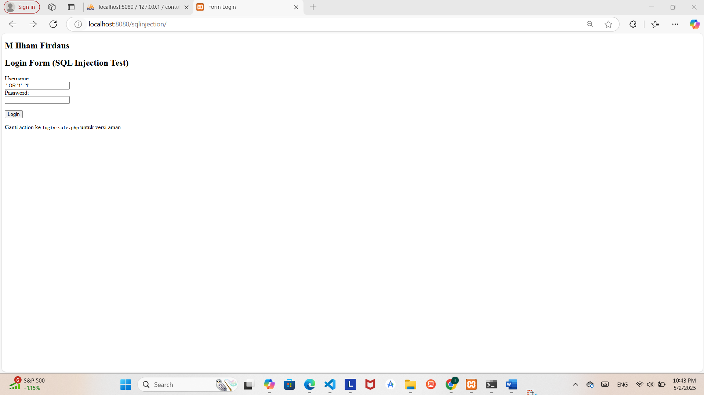
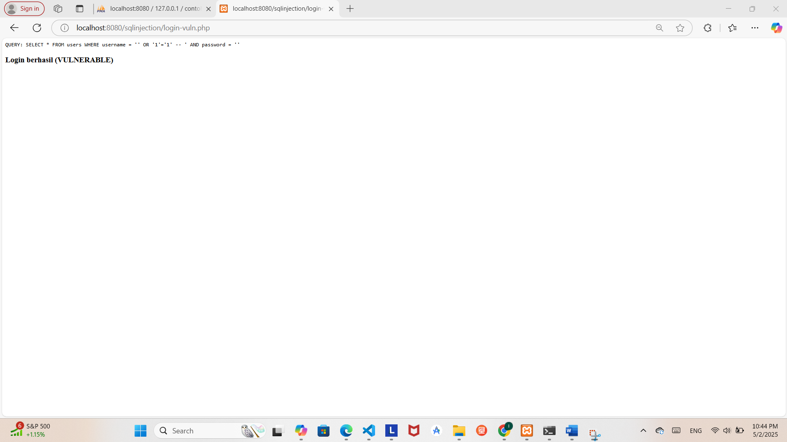
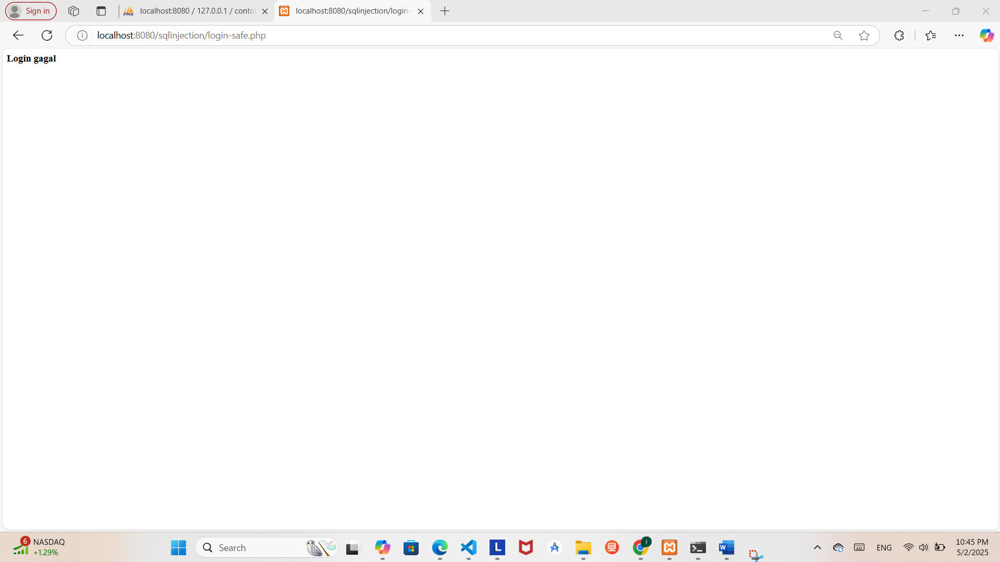
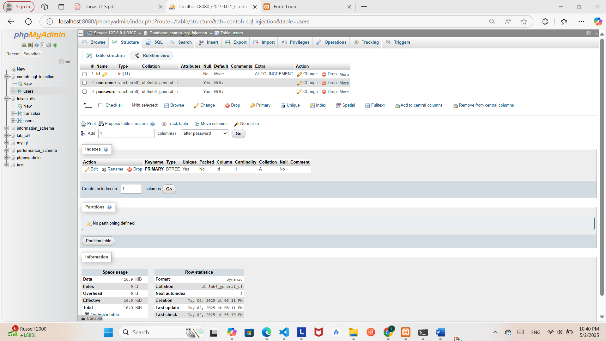
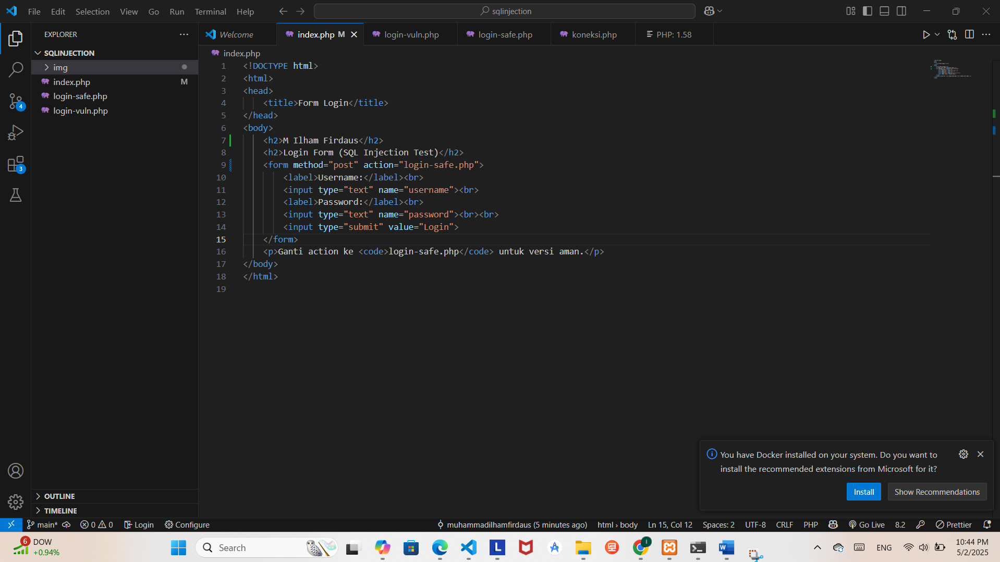

Nama : M Ilham Firdaus
Kelas : TI.23.C1
Nim : M Ilham Firdaus
Universitas : Universitas Pelita Bangsa

# SQL Injection Report

Repositori ini berisi dokumentasi dan simulasi dasar mengenai teknik SQL Injection, termasuk contoh keberhasilan dan kegagalan injeksi serta solusi pencegahannya. Tujuan dari repositori ini adalah untuk edukasi dan meningkatkan kesadaran terhadap pentingnya validasi input dalam pengembangan aplikasi berbasis web.

## 🔍 Deskripsi

SQL Injection adalah teknik serangan di mana penyerang dapat menyisipkan atau "menyuntikkan" perintah SQL berbahaya ke dalam input aplikasi untuk mengakses, memodifikasi, atau menghapus data dalam basis data tanpa izin.

Repo ini mendemonstrasikan bagaimana SQL Injection dapat dilakukan pada form login sederhana dan bagaimana aplikasi bisa merespons terhadap upaya injeksi tersebut.

## 🧪 Simulasi

### 1. **Form Login**
- Contoh form login digunakan sebagai target simulasi injeksi SQL.

### 2. **Upaya Injeksi**
- Injeksi SQL dilakukan dengan input seperti `' OR 1=1 --` yang secara logika mengakali kueri SQL menjadi selalu benar.

### 3. **Hasil: Berhasil**
- Login berhasil dilakukan tanpa kredensial yang valid karena adanya kerentanan.

### 4. **Hasil: Gagal**
- Contoh lain menunjukkan ketika injeksi tidak berhasil.

### 5. **Struktur Database**
- Ilustrasi struktur database yang menjadi target serangan.

### 6. **Solusi**
- Solusi utama adalah menggunakan *prepared statement* dan validasi input untuk mencegah SQL Injection.

## ✅ Rekomendasi Pencegahan

- Gunakan prepared statements (parameterized queries).
- Validasi dan sanitasi semua input pengguna.
- Gunakan ORM (Object-Relational Mapping) saat memungkinkan.
- Batasi hak akses database.
- Implementasi WAF (Web Application Firewall).

## 📜 Lisensi

Repositori ini disediakan hanya untuk tujuan pembelajaran dan edukasi. Jangan gunakan pengetahuan ini untuk kegiatan ilegal.
